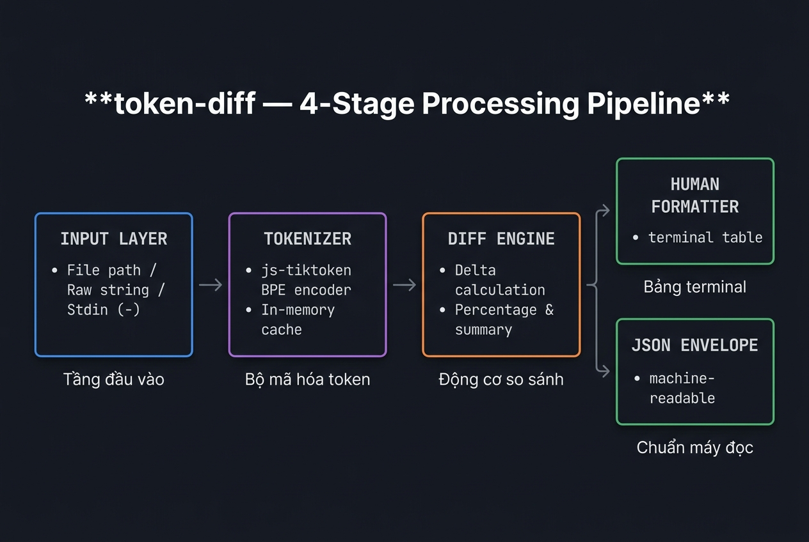
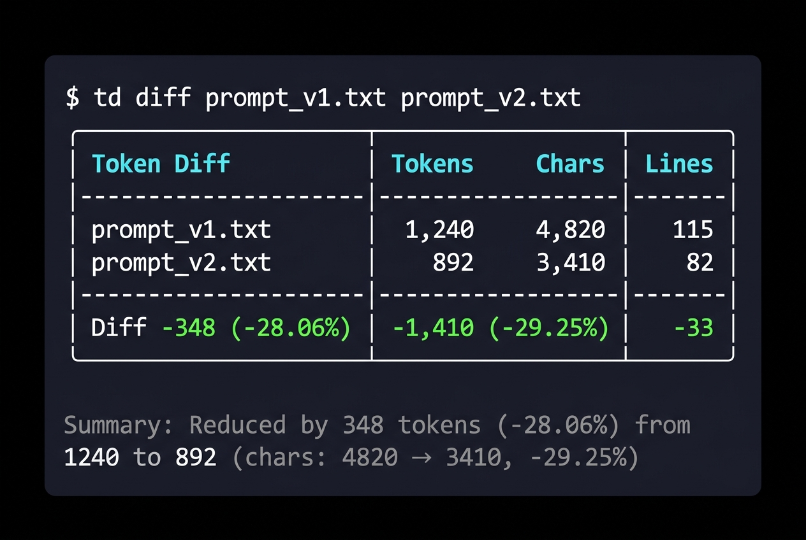
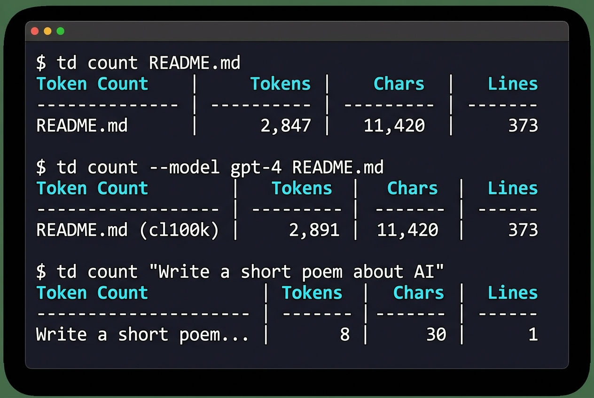
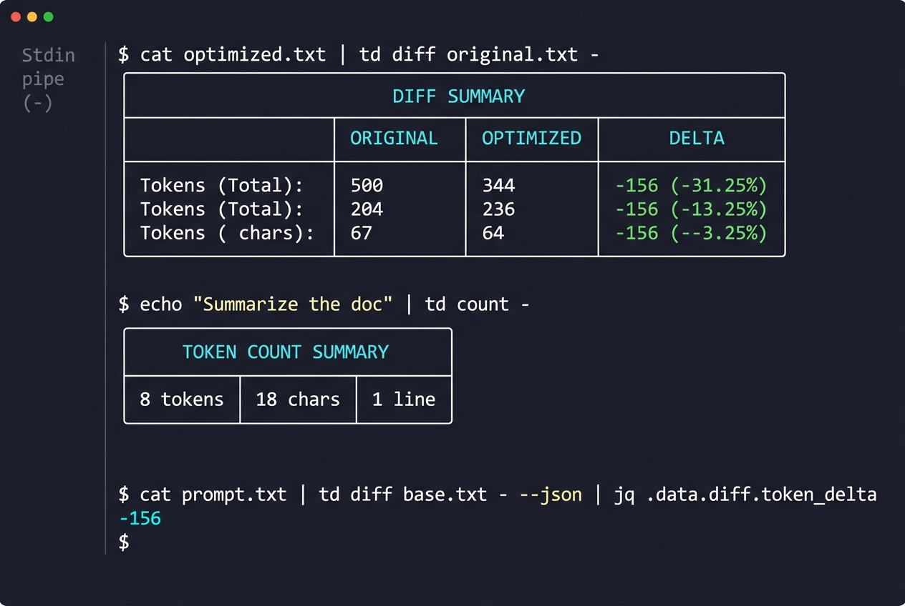
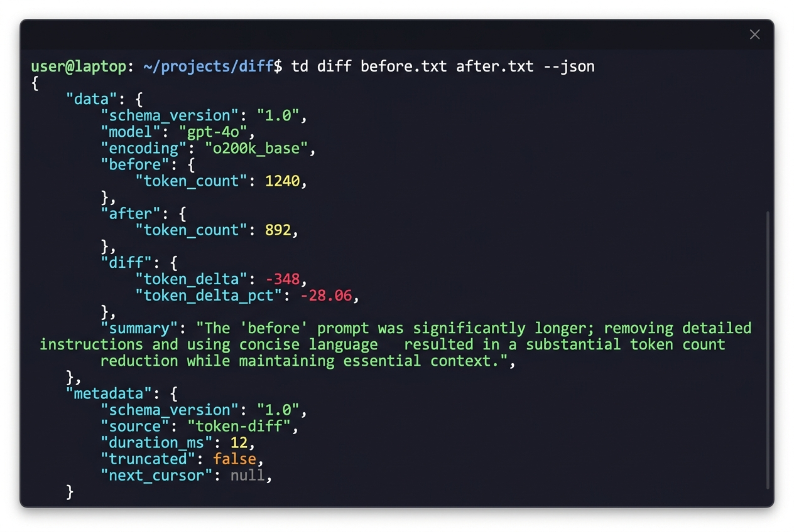

<p align="center">
  
</p>

<h1 align="center">token-diff</h1>

<p align="center">
  <strong>Deterministic Token Usage Measurement & Context Diff Infrastructure</strong>
</p>

<p align="center">
  <a href="README.md">English</a> • <a href="README.vi.md">Tiếng Việt</a>
</p>

<p align="center">
  
  = 18.0.0" />
  
  
  
  
</p>

<p align="center">
  
</p>

---

## Table of Contents
1. [Executive Summary](#executive-summary)
2. [Why token-diff?](#why-token-diff)
3. [Key Architecture & Capabilities](#key-architecture--capabilities)
4. [Installation & Setup](#installation--setup)
5. [CLI Command Reference](#cli-command-reference)
   - [token-diff diff](#1-token-diff-diff)
   - [token-diff count](#2-token-diff-count)
   - [Standard Input (stdin) Pipelining](#3-standard-input-stdin-pipelining)
6. [Programmatic SDK / Library Usage](#programmatic-sdk--library-usage)
7. [Standardized API Transport Envelope](#standardized-api-transport-envelope)
8. [Deterministic Error Model & Exit Codes](#deterministic-error-model--exit-codes)
9. [Supported Models & Encoding Mapping](#supported-models--encoding-mapping)
10. [Performance Benchmarks & Memory Profile](#performance-benchmarks--memory-profile)
11. [Development & Contributing](#development--contributing)
12. [License & Acknowledgments](#license--acknowledgments)

---

## Executive Summary

`token-diff` is an ultra-fast, zero-native-dependency CLI tool and TypeScript SDK designed specifically to evaluate token consumption and context optimization deltas across LLM workflows, autonomous agent loops, and prompt engineering pipelines.

Whether verifying the efficacy of prompt compression algorithms, monitoring multi-turn agent tool call outputs, or setting up strict token budgets in CI/CD test suites, `token-diff` provides exact, reproducible counts and delta calculations.

---

## Why token-diff?

- **Zero Cloud / Network Overhead**: Evaluates tokens 100% locally. Zero API keys, zero rate-limits, and zero risk of leaking private repository source code or sensitive prompt instructions.
- **Pure JavaScript Tokenization**: Built on top of `js-tiktoken` without requiring Rust bindings or compiled WebAssembly (WASM) runtimes, ensuring universal cross-platform portability across Windows, macOS, Linux, and serverless runtimes.
- **Agent-Ready JSON Envelopes**: Integrates seamlessly with multi-agent control planes, returning bounded metadata, duration metrics, and structured error envelopes.
- **Deterministic Exit Codes**: Distinguishes operational and usage errors cleanly for seamless integration into shell scripts, CI assertion gates, and pre-commit hooks.

---

## Key Architecture & Capabilities

<p align="center">
  
</p>

- **In-Memory Encoder Cache**: Reuses loaded BPE vocabulary instances across repeated invocations, reducing tokenization latency to sub-millisecond ranges for typical prompt sizes.
- **Zero Div-by-Zero Hazards**: Handles empty initial prompts and zero-token states gracefully with strict edge-case safety.
- **Streamlined CLI UX**: Automatic alignment for tabular terminal reporting and standardized Unix hyphen (`-`) pipe resolution.

---

## Installation & Setup

### Immediate execution via `npx` (No installation needed):
```bash
# Using the full package name
npx ai-token-diff --help

# Or run diff directly
npx ai-token-diff diff "Original prompt" "Optimized prompt"
```

### Global installation (Recommended for daily workflow):
Install globally once to unlock the ultra-short `td` command everywhere in your terminal:
```bash
npm install -g ai-token-diff

# Now you can use the concise `td` shorthand command!
td --help
```

### Local project dependency:
```bash
npm install -D ai-token-diff
```

---

## CLI Command Reference

You can use either the concise alias **`td`** or the canonical binary names **`token-diff`** / **`ai-token-diff`**.

### 1. `td diff` (or `token-diff diff`)

Calculates exact token, character, and line differences between two inputs:

```bash
td diff [options] <before> <after>
```

#### Smart Input Detection (Files or Raw Strings)
`token-diff` automatically detects whether `<before>` and `<after>` are file paths or raw text strings:
- **File vs File**: `td diff formatter.ts formatter.v2.ts`
- **Raw String vs Raw String**: `td diff "Please write a python function to calculate fibonacci" "Write python fibonacci"`
- **File vs Raw String**: `td diff base_system_prompt.txt "You are a concise code assistant."`
- **Standard Input (`-`)**: `cat new_prompt.txt | td diff old_prompt.txt -`

> **Note**: If an input does not exist on disk, `token-diff` seamlessly falls back to treating it as raw text and displays a subtle `[WARN]` to prevent mistyped filename errors.

#### Options
| Option | Default | Description |
|---|---|---|
| `-m, --model <model>` | `gpt-4o` | Target model name or explicit encoding |
| `--json` | `false` | Emits structured JSON envelope to stdout |
| `-h, --help` | - | Display help for command |

<p align="center">
  
</p>

---

### 2. `td count` (or `token-diff count`)

Counts tokens, characters, and lines for a single file, raw text string, or stdin stream:

```bash
td count [options] <file_or_string>
```

#### Examples:
```bash
# Count tokens for a file
td count README.md --model gpt-4o

# Count tokens for a raw prompt string directly
td count "You are a senior fullstack engineer."
```

<p align="center">
  
</p>

---

### 3. Standard Input (stdin) Pipelining

Pass output from compressors, linters, or generator scripts directly into `token-diff` using `-`:

```bash
# Compare a baseline file against standard input
cat optimized.txt | td diff original.txt -

# Inspect stdin token footprint directly
git diff HEAD~1 | td count -

# Pipe into jq for scripting
cat prompt.txt | td diff base.txt - --json | jq .data.diff.token_delta
```

<p align="center">
  
</p>

---

## Programmatic SDK / Library Usage

`token-diff` is distributed with complete ESM and TypeScript definitions:

```typescript
import {
  countTokens,
  computeDiff,
  formatHuman,
  formatJson,
  TokenDiffReport
} from 'token-diff';

// 1. Tokenize inputs
const original = countTokens('Write a complete guide on Docker containerization.', 'gpt-4o');
const compressed = countTokens('Guide on Docker containerization.', 'gpt-4o');

// 2. Compute exact diff
const diffReport: TokenDiffReport = computeDiff(original, compressed, {
  beforeLabel: 'original',
  afterLabel: 'compressed',
});

console.log(`Saved ${Math.abs(diffReport.diff.token_delta)} tokens!`);
console.log(formatHuman(diffReport));

// 3. Obtain standardized JSON string
const jsonOutput: string = formatJson(diffReport, 15);
```

---

## Standardized API Transport Envelope

When invoked with `--json`, `token-diff` guarantees structured output conforming to the standard tool transport envelope:

<p align="center"></p>

```json
{
  "data": {
    "schema_version": "1.0",
    "model": "gpt-4o",
    "encoding": "o200k_base",
    "before": {
      "label": "raw_prompt.txt",
      "token_count": 1240,
      "char_count": 4820,
      "line_count": 115
    },
    "after": {
      "label": "compressed_prompt.txt",
      "token_count": 892,
      "char_count": 3410,
      "line_count": 82
    },
    "diff": {
      "token_delta": -348,
      "token_delta_pct": -28.06,
      "char_delta": -1410,
      "char_delta_pct": -29.25
    },
    "summary": "Reduced by 348 tokens (-28.06%) from 1240 to 892 (chars: 4820 → 3410, -29.25%)"
  },
  "metadata": {
    "schema_version": "1.0",
    "source": "token-diff",
    "duration_ms": 14,
    "truncated": false,
    "next_cursor": null
  }
}
```

---

## Deterministic Error Model & Exit Codes

All exit codes are deterministic to facilitate reliable script assertions and automated test gates:

| Exit Code | Error Code | Description / Scenario |
|:---:|---|---|
| `0` | - | Successful execution. |
| `1` | `INTERNAL_ERROR` | Unhandled runtime failure or pipe read failure. |
| `2` | `INVALID_INPUT` / `UNSUPPORTED_OPERATION` | Invalid CLI arguments, reading both inputs from stdin, or unsupported model. |
| `3` | `NOT_FOUND` | Specified input file does not exist on disk. |
| `4` | `PERMISSION_DENIED` | Insufficient filesystem read permissions. |

#### Structured JSON Error Envelope:
When `--json` is enabled and an error occurs, the error details are serialized to `stdout`:
```json
{
  "error": {
    "code": "NOT_FOUND",
    "message": "File not found: missing_file.txt",
    "details": {
      "path": "missing_file.txt"
    }
  },
  "metadata": {
    "schema_version": "1.0",
    "source": "token-diff"
  }
}
```

---

## Supported Models & Encoding Mapping

`token-diff` includes built-in mappings and automatic model prefix detection:

| Encoding | Associated Common Models |
|---|---|
| `o200k_base` | `gpt-4o`, `gpt-4o-mini`, `chatgpt-4o-latest`, `o1`, `o1-mini`, `o1-preview` |
| `cl100k_base` | `gpt-4`, `gpt-4-turbo`, `gpt-4-32k`, `gpt-3.5-turbo`, `text-embedding-ada-002`, `text-embedding-3-small`, `text-embedding-3-large` |
| `p50k_base` | `text-davinci-003`, `text-davinci-002` |
| `r50k_base` | `davinci` |

*You can also directly supply the encoding name as the model parameter (e.g. `--model o200k_base`).*

---

## Performance Benchmarks & Memory Profile

- **Cold Start**: ~80ms (Node.js engine initialization).
- **Execution Latency**: <15ms for typical documents (<50 KLOC / <10,000 tokens).
- **Memory Footprint**: <40MB RSS under active tokenization.
- **Pure In-Memory Operations**: Zero temporary files written to disk.

---

## Development & Contributing

```bash
# Clone the repository
git clone https://github.com/Khoa180806/token-diff.git
cd token-diff

# Install dependencies
npm install

# Run unit and integration tests (20 tests)
npm test

# Build production distribution
npm run build

# Typecheck and linting
npm run lint
```

---

## License & Acknowledgments

This project is licensed under the [MIT License](LICENSE).  
Maintained by Khoa180806.
