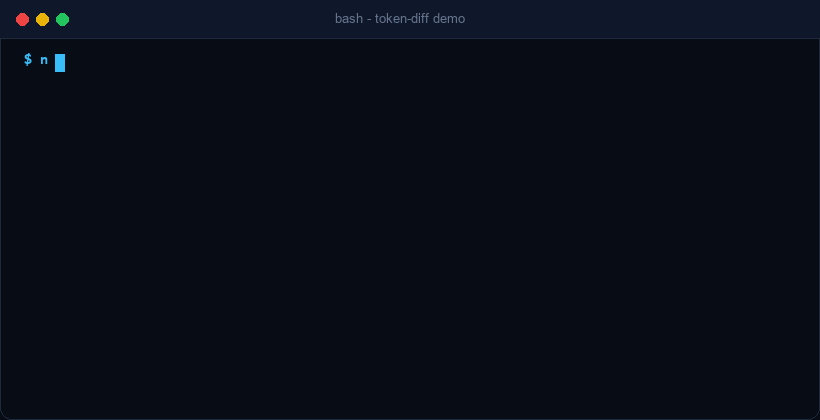

<p align="center">
  
</p>

<p align="center">
  <strong>Fast, deterministic token comparison and context measurement tool for LLM workflows.</strong>
</p>

<p align="center">
  <a href="#english">English</a> • <a href="#tiếng-việt">Tiếng Việt</a>
</p>

<p align="center">
  
  = 18.0.0" />
  
  
  
</p>

<p align="center">
  
</p>

---

<a name="english"></a>
# English Documentation

## Table of Contents
- [Overview](#overview)
- [Key Features](#key-features)
- [Installation](#installation)
- [Quick Start](#quick-start)
- [CLI Command Reference](#cli-command-reference)
  - [diff Command](#1-diff-command)
  - [count Command](#2-count-command)
- [Library / SDK Usage](#library--sdk-usage)
- [Machine-Readable JSON Envelope](#machine-readable-json-envelope)
- [Exit Codes & Error Handling](#exit-codes--error-handling)
- [Supported Encodings & Models](#supported-encodings--models)
- [Development & Testing](#development--testing)
- [License](#license)

---

## Overview

`token-diff` is a lightweight, pure-JavaScript CLI and SDK designed to compare token counts and context sizes between two texts, files, or standard inputs. It helps developers, agent architects, and prompt engineers measure prompt optimizations, tool output compressions, and context window efficiency with mathematical precision.

## Key Features

- **Blazing Fast & Zero WASM Dependencies**: Powered by pure JS `js-tiktoken` tokenization.
- **Accurate Model Mapping**: Supports modern OpenAI families (`gpt-4o`, `gpt-4o-mini`, `o1`, `gpt-4`, `gpt-3.5-turbo`, embeddings) across `o200k_base`, `cl100k_base`, `p50k_base`, and `r50k_base`.
- **Dual Presentation**: Clean, aligned tabular format for humans and strict standardized JSON envelope for agentic workflows.
- **Unix Pipeline Friendly**: Supports reading from standard input via `-`.
- **Deterministic Error Exit Codes**: Easily integrated into automated CI/CD and script evaluations.

## Installation

### Run directly with `npx`:
```bash
npx token-diff --help
```

### Install globally via `npm`:
```bash
npm install -g token-diff
```

---

## Quick Start

### 1. Compare Two Files
```bash
token-diff diff before.txt after.txt
```

### 2. Output Standard JSON
```bash
token-diff diff before.txt after.txt --json
```

### 3. Pipeline via Stdin
```bash
cat compressed_prompt.txt | token-diff diff original_prompt.txt -
```

### 4. Count Tokens in a Single File
```bash
token-diff count prompt.txt --model gpt-4o
```

---

## CLI Command Reference

### 1. `diff` Command

Compares token counts between two inputs:

```bash
token-diff diff [options] <before> <after>
```

#### Arguments
- `<before>`: Path to the original file, or `-` to read from stdin.
- `<after>`: Path to the modified file, or `-` to read from stdin.

#### Options
- `-m, --model <model>`: Target model or encoding (default: `gpt-4o`).
- `--json`: Emit a structured machine-readable JSON envelope to `stdout`.
- `-h, --help`: Display command options.

#### Sample Human Output:
```text
=== Token Diff Report ===
Model: gpt-4o (o200k_base)

Target         Tokens       Chars        Lines     
---------------------------------------------------
prompt_v1.txt   1240         4820          115
prompt_v2.txt    892         3410           82
---------------------------------------------------
Diff           -348 (-28.06%) -1410 (-29.25%) -33        

Summary: Reduced by 348 tokens (-28.06%) from 1240 to 892 (chars: 4820 → 3410, -29.25%)
```

---

### 2. `count` Command

Measures token and character statistics for a single input:

```bash
token-diff count [options] <file>
```

#### Arguments
- `<file>`: Path to file, or `-` for standard input.

#### Options
- `-m, --model <model>`: Target model or encoding (default: `gpt-4o`).
- `--json`: Emit machine-readable envelope.

#### Sample Output:
```text
=== Token Count Report ===
File: prompt.txt
Model: gpt-4o (o200k_base)

Tokens: 120
Chars:  540
Lines:  14
```

---

## Library / SDK Usage

`token-diff` is fully typed and can be imported directly into TypeScript or JavaScript projects:

```typescript
import { countTokens, computeDiff, formatJson, formatHuman } from 'token-diff';

const original = countTokens('Write a comprehensive overview of cloud computing.', 'gpt-4o');
const optimized = countTokens('Summarize cloud computing.', 'gpt-4o');

const diffReport = computeDiff(original, optimized, {
  beforeLabel: 'original',
  afterLabel: 'optimized',
});

console.log(formatHuman(diffReport));
```

---

## Machine-Readable JSON Envelope

When `--json` is supplied, `token-diff` wraps all outputs within a standard envelope:

```json
{
  "data": {
    "schema_version": "1.0",
    "model": "gpt-4o",
    "encoding": "o200k_base",
    "before": {
      "label": "prompt_v1.txt",
      "token_count": 1240,
      "char_count": 4820,
      "line_count": 115
    },
    "after": {
      "label": "prompt_v2.txt",
      "token_count": 892,
      "char_count": 3410,
      "line_count": 82
    },
    "diff": {
      "token_delta": -348,
      "token_delta_pct": -28.06,
      "char_delta": -1410,
      "char_delta_pct": -29.25
    },
    "summary": "Reduced by 348 tokens (-28.06%) from 1240 to 892 (chars: 4820 → 3410, -29.25%)"
  },
  "metadata": {
    "schema_version": "1.0",
    "source": "token-diff",
    "duration_ms": 12,
    "truncated": false,
    "next_cursor": null
  }
}
```

---

## Exit Codes & Error Handling

All exit codes are deterministic for reliable scripting and evaluation pipelines:

| Exit Code | Error Code | Description / Scenario |
|:---:|---|---|
| `0` | - | Successful execution. |
| `1` | `INTERNAL_ERROR` | Unexpected runtime error or stdin read failure. |
| `2` | `INVALID_INPUT` / `UNSUPPORTED_OPERATION` | Invalid CLI arguments, reading both inputs from stdin, or unsupported model. |
| `3` | `NOT_FOUND` | Specified file does not exist on disk. |
| `4` | `PERMISSION_DENIED` | Insufficient permissions to read the specified file. |

When `--json` is enabled and an error occurs, structured JSON is emitted:

```json
{
  "error": {
    "code": "NOT_FOUND",
    "message": "File not found: missing.txt",
    "details": {
      "path": "missing.txt"
    }
  },
  "metadata": {
    "schema_version": "1.0",
    "source": "token-diff"
  }
}
```

---

## Supported Encodings & Models

| Encoding | Associated Common Models |
|---|---|
| `o200k_base` | `gpt-4o`, `gpt-4o-mini`, `o1`, `o1-mini`, `o1-preview` |
| `cl100k_base` | `gpt-4`, `gpt-4-turbo`, `gpt-3.5-turbo`, `text-embedding-3-small`, `text-embedding-3-large` |
| `p50k_base` | `text-davinci-003`, `text-davinci-002` |
| `r50k_base` | `davinci` |

---

## Development & Testing

```bash
# Clone the repository
git clone https://github.com/Khoa180806/token-diff.git
cd token-diff

# Install dependencies
npm install

# Run test suite
npm test

# Build production bundle
npm run build

# Type check
npm run lint
```

---

## License

MIT License © 2026

---

<a name="tiếng-việt"></a>
# Tài liệu Tiếng Việt

## Mục lục
- [Tổng quan](#tổng-quan)
- [Tính năng nổi bật](#tính-năng-nổi-bật)
- [Cài đặt](#cài-đặt)
- [Bắt đầu nhanh](#bắt-đầu-nhanh)
- [Hướng dẫn Lệnh dòng lệnh (CLI)](#hướng-dẫn-lệnh-dòng-lệnh-cli)
  - [Lệnh diff](#1-lệnh-diff)
  - [Lệnh count](#2-lệnh-count)
- [Sử dụng như Thư viện (SDK)](#sử-dụng-như-thư-viện-sdk)
- [Định dạng JSON Envelope](#định-dạng-json-envelope)
- [Mã lỗi và Mã thoát (Exit Codes)](#mã-lỗi-và-mã-thoát-exit-codes)
- [Các mô hình & Bộ mã hóa hỗ trợ](#các-mô-hình--bộ-mã-hóa-hỗ-trợ)
- [Phát triển & Kiểm thử](#phát-triển--kiểm-thử)
- [Giấy phép](#giấy-phép)

---

## Tổng quan

`token-diff` là công cụ dòng lệnh (CLI) và bộ công cụ SDK bằng TypeScript/JavaScript thuần, chuyên dụng để đo lường và so sánh mức tiêu thụ token giữa hai văn bản, tệp tin hoặc luồng đầu vào tiêu chuẩn. Công cụ giúp kỹ sư prompt, nhà phát triển agent và AI builder đánh giá chính xác hiệu quả tối ưu hóa prompt và nén ngữ cảnh context.

## Tính năng nổi bật

- **Tốc độ cực nhanh & Không phụ thuộc WASM**: Sử dụng `js-tiktoken` thuần JS, hoạt động ổn định trên mọi nền tảng.
- **Nhận diện Model thông minh**: Tự động ánh xạ các model phổ biến (`gpt-4o`, `gpt-4`, `o1`, `gpt-3.5-turbo`,...) sang các chuẩn mã hóa `o200k_base`, `cl100k_base`,...
- **Đầu ra linh hoạt**: Hỗ trợ hiển thị bảng so sánh trực quan cho người dùng hoặc xuất JSON chuẩn hóa có metadata cho AI Agent.
- **Hỗ trợ Unix Pipeline**: Cho phép truyền dữ liệu qua stdin bằng ký hiệu `-`.
- **Mã thoát tiền định (Deterministic Exit Codes)**: Thuận tiện tích hợp vào script tự động và CI/CD.

## Cài đặt

### Chạy trực tiếp với `npx`:
```bash
npx token-diff --help
```

### Cài đặt toàn cục qua `npm`:
```bash
npm install -g token-diff
```

---

## Bắt đầu nhanh

### 1. So sánh hai tệp
```bash
token-diff diff before.txt after.txt
```

### 2. Xuất dữ liệu JSON
```bash
token-diff diff before.txt after.txt --json
```

### 3. Nhận dữ liệu qua stdin
```bash
cat prompt_moi.txt | token-diff diff prompt_goc.txt -
```

### 4. Đếm số token của một tệp
```bash
token-diff count prompt.txt --model gpt-4o
```

---

## Hướng dẫn Lệnh dòng lệnh (CLI)

### 1. Lệnh `diff`

So sánh token giữa hai nguồn đầu vào:

```bash
token-diff diff [tùy_chọn] <before> <after>
```

#### Tham số
- `<before>`: Đường dẫn tệp ban đầu, hoặc `-` để đọc từ stdin.
- `<after>`: Đường dẫn tệp sau chỉnh sửa, hoặc `-` để đọc từ stdin.

#### Tùy chọn
- `-m, --model <model>`: Tên mô hình hoặc encoding cần dùng (mặc định: `gpt-4o`).
- `--json`: Xuất định dạng JSON envelope ra stdout.
- `-h, --help`: Xem trợ giúp.

---

### 2. Lệnh `count`

Đo số lượng token và ký tự của một tệp duy nhất:

```bash
token-diff count [tùy_chọn] <file>
```

#### Tham số
- `<file>`: Đường dẫn tệp, hoặc `-` nếu đọc từ stdin.

#### Tùy chọn
- `-m, --model <model>`: Tên mô hình hoặc encoding (mặc định: `gpt-4o`).
- `--json`: Xuất định dạng JSON.

---

## Sử dụng như Thư viện (SDK)

`token-diff` hỗ trợ đầy đủ TypeScript definitions:

```typescript
import { countTokens, computeDiff, formatJson, formatHuman } from 'token-diff';

const banDau = countTokens('Mô tả chi tiết kiến trúc hệ thống.', 'gpt-4o');
const toiUu = countTokens('Tóm tắt kiến trúc hệ thống.', 'gpt-4o');

const baoCao = computeDiff(banDau, toiUu, {
  beforeLabel: 'ban_dau',
  afterLabel: 'toi_uu',
});

console.log(formatHuman(baoCao));
```

---

## Định dạng JSON Envelope

Khi bật cờ `--json`, kết quả được đóng gói trong envelope chuẩn hóa:

```json
{
  "data": {
    "schema_version": "1.0",
    "model": "gpt-4o",
    "encoding": "o200k_base",
    "before": {
      "label": "prompt_v1.txt",
      "token_count": 1240,
      "char_count": 4820,
      "line_count": 115
    },
    "after": {
      "label": "prompt_v2.txt",
      "token_count": 892,
      "char_count": 3410,
      "line_count": 82
    },
    "diff": {
      "token_delta": -348,
      "token_delta_pct": -28.06,
      "char_delta": -1410,
      "char_delta_pct": -29.25
    },
    "summary": "Reduced by 348 tokens (-28.06%) from 1240 to 892 (chars: 4820 → 3410, -29.25%)"
  },
  "metadata": {
    "schema_version": "1.0",
    "source": "token-diff",
    "duration_ms": 12,
    "truncated": false,
    "next_cursor": null
  }
}
```

---

## Mã lỗi và Mã thoát (Exit Codes)

| Mã thoát | Mã lỗi | Tình huống phát sinh |
|:---:|---|---|
| `0` | - | Chạy thành công không có lỗi. |
| `1` | `INTERNAL_ERROR` | Lỗi ngoại lệ runtime không mong muốn hoặc đọc stdin thất bại. |
| `2` | `INVALID_INPUT` / `UNSUPPORTED_OPERATION` | Sai tham số CLI, truyền cả hai đầu vào là `-`, hoặc mô hình không hỗ trợ. |
| `3` | `NOT_FOUND` | Tệp chỉ định không tồn tại trên ổ đĩa. |
| `4` | `PERMISSION_DENIED` | Không có quyền đọc tệp chỉ định. |

---

## Các mô hình & Bộ mã hóa hỗ trợ

| Encoding | Mô hình phổ biến tương ứng |
|---|---|
| `o200k_base` | `gpt-4o`, `gpt-4o-mini`, `o1`, `o1-mini`, `o1-preview` |
| `cl100k_base` | `gpt-4`, `gpt-4-turbo`, `gpt-3.5-turbo`, `text-embedding-3-small`, `text-embedding-3-large` |
| `p50k_base` | `text-davinci-003`, `text-davinci-002` |
| `r50k_base` | `davinci` |

---

## Phát triển & Kiểm thử

```bash
# Cài đặt thư viện
npm install

# Chạy toàn bộ test
npm test

# Build tệp chạy production
npm run build

# Kiểm tra type TypeScript
npm run lint
```

---

## Giấy phép

Bản quyền phát hành theo giấy phép MIT License © 2026.
