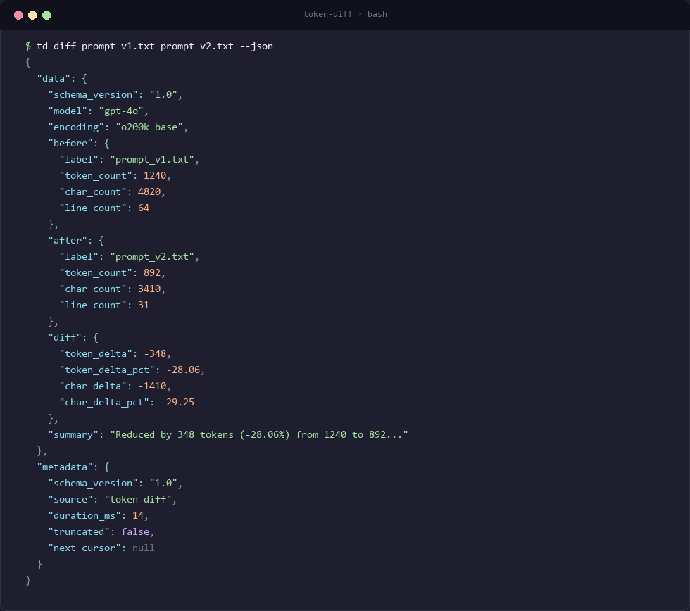

# API & CLI Contract Reference

Comprehensive technical contract specifications for the programmatic TypeScript/JavaScript SDK and the command-line CLI transport interface. This document details function signatures, CLI flags, JSON envelope schemas, and deterministic exit codes.

---

## 1. CLI Command Interface

The CLI executable is registered under the canonical aliases `td`, `token-diff`, and `ai-token-diff` (source: `package.json#L6-L10`, `src/cli.ts`).

### Command: `td diff <before> <after>`
Calculates token, character, and line count deltas between two inputs (source: `src/cli.ts#L86-L122`).

- **Arguments**:
  - `<before>`: Path to baseline file, standard input pipe (`-`), or literal prompt string.
  - `<after>`: Path to comparison file, standard input pipe (`-`), or literal prompt string.
- **Options**:
  - `-m, --model <name>`: Model identifier (e.g. `gpt-4o`, `gpt-4`, `o1`) or explicit encoding (e.g. `o200k_base`, `cl100k_base`). Default: `'gpt-4o'`.
  - `-j, --json`: Emits standardized JSON transport envelope to `stdout`. Default: `false`.
  - `-h, --help`: Displays command usage guide.

### Command: `td count <target>`
Counts tokens, characters, and lines for a single input (source: `src/cli.ts#L124-L148`).

- **Arguments**:
  - `<target>`: Path to target file, standard input pipe (`-`), or literal prompt string.
- **Options**:
  - `-m, --model <name>`: Model or encoding identifier. Default: `'gpt-4o'`.
  - `-j, --json`: Emits standardized JSON count envelope to `stdout`. Default: `false`.

---

## 2. Programmatic TypeScript SDK Reference

The library exposes fully typed ESM and TypeScript declarations for programmatic integration (source: `src/index.ts`, `src/types.ts`).

### Package Export
```typescript
import {
  countTokens,
  computeDiff,
  resolveEncodingForModel,
  formatJson,
  formatHuman,
  formatCountJson,
  formatCountHuman,
  type TokenizerResult,
  type TokenDiffReport,
  type TokenCountReport,
  type ApiEnvelope,
  type SupportedEncoding,
} from 'ai-token-diff';
```

### Function: `countTokens(text, modelOrEncoding?)`
Tokenizes a string and returns token counts, character lengths, and line counts (source: `src/tokenizer.ts#L79-L94`).

- **Parameters**:
  - `text` (`string`): Target text string to tokenize.
  - `modelOrEncoding` (`string`, optional, default: `'gpt-4o'`): OpenAI model name or explicit encoding name.
- **Returns**: `TokenizerResult`
  ```typescript
  interface TokenizerResult {
    tokenCount: number;
    tokens: number[];
    charCount: number;
    lineCount: number;
    encoding: SupportedEncoding;
    model: string;
  }
  ```

### Function: `computeDiff(before, after, options?)`
Computes token differences, character differences, and percentage deltas between two `TokenizerResult` objects (source: `src/diff.ts#L37-L84`).

- **Parameters**:
  - `before` (`TokenizerResult`): Baseline tokenization result.
  - `after` (`TokenizerResult`): Comparison tokenization result.
  - `options` (`DiffOptions`, optional):
    - `beforeLabel?: string` (default: `'before'`)
    - `afterLabel?: string` (default: `'after'`)
    - `schemaVersion?: string` (default: `'1.0'`)
- **Returns**: `TokenDiffReport`
  ```typescript
  interface TokenDiffReport {
    schema_version: string;
    model: string;
    encoding: string;
    before: {
      label: string;
      token_count: number;
      char_count: number;
      line_count: number;
    };
    after: {
      label: string;
      token_count: number;
      char_count: number;
      line_count: number;
    };
    diff: {
      token_delta: number;      // after - before (negative indicates token reduction)
      token_delta_pct: number;  // percentage change rounded to 2 decimal places
      char_delta: number;
      char_delta_pct: number;
    };
    summary: string;
  }
  ```

### Function: `resolveEncodingForModel(modelOrEncoding)`
Resolves a model name or encoding string into one of the 4 supported canonical encodings (source: `src/models.ts#L36-L65`).

- **Supported Encodings**: `'o200k_base' | 'cl100k_base' | 'p50k_base' | 'r50k_base'`.
- **Throws**: `TokenDiffError` with code `'UNSUPPORTED_OPERATION'` if unrecognized.

---

## 3. Standardized API Transport Envelope (`--json`)

When invoked with `--json`, output is wrapped in a standardized transport envelope matching AI agent tool specifications (source: `src/formatter.ts#L4-L32`, `src/types.ts#L51-L54`).

### Envelope Schema
```typescript
interface ApiEnvelope<T> {
  data: T;
  metadata: {
    schema_version: string; // "1.0"
    source: "token-diff";
    duration_ms: number;    // Execution duration in milliseconds
    truncated: boolean;     // false
    next_cursor: string | null; // null
  };
}
```

### Diff Response Sample
```json
{
  "data": {
    "schema_version": "1.0",
    "model": "gpt-4o",
    "encoding": "o200k_base",
    "before": {
      "label": "original.txt",
      "token_count": 1240,
      "char_count": 4820,
      "line_count": 115
    },
    "after": {
      "label": "optimized.txt",
      "token_count": 892,
      "char_count": 3410,
      "line_count": 82
    },
    "diff": {
      "token_delta": -348,
      "token_delta_pct": -28.06,
      "char_delta": -1410,
      "char_delta_pct": -29.25
    },
    "summary": "Reduced by 348 tokens (-28.06%) from 1240 to 892 (chars: 4820 → 3410, -29.25%)"
  },
  "metadata": {
    "schema_version": "1.0",
    "source": "token-diff",
    "duration_ms": 14,
    "truncated": false,
    "next_cursor": null
  }
}
```

  
*Figure 1: Standardized JSON transport envelope output emitted to stdout when invoked with --json flag.*

---

## 4. Error Envelope & Deterministic Exit Codes

All errors map deterministically to standardized POSIX exit codes (source: `src/errors.ts#L3-L13`, `src/cli.ts#L66-L84`).

| Exit Code | Error Code Constant | Scenario / Trigger Condition |
|:---:|---|---|
| `0` | `EXIT_SUCCESS` | Command completed successfully; output emitted to `stdout`. |
| `1` | `INTERNAL_ERROR` | Unhandled runtime failure or pipe stream read error. |
| `2` | `INVALID_INPUT` / `UNSUPPORTED_OPERATION` | Invalid CLI arguments, unknown model, or `-` used for both inputs. |
| `3` | `NOT_FOUND` | Specified file does not exist (when strict checking applied). |
| `4` | `PERMISSION_DENIED` | File system read permission denied on target input file. |

### Error Envelope Sample (`--json` mode)
```json
{
  "error": {
    "code": "INVALID_INPUT",
    "message": "Both inputs cannot be standard input (-).",
    "details": {}
  },
  "metadata": {
    "schema_version": "1.0",
    "source": "token-diff"
  }
}
```
