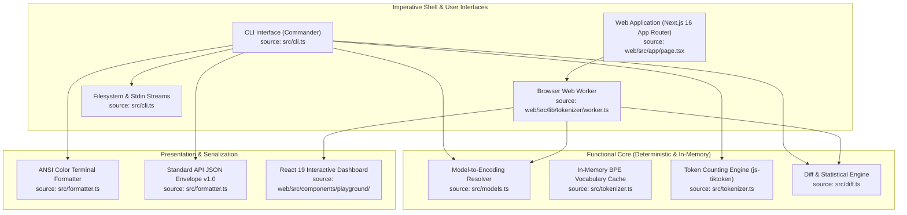
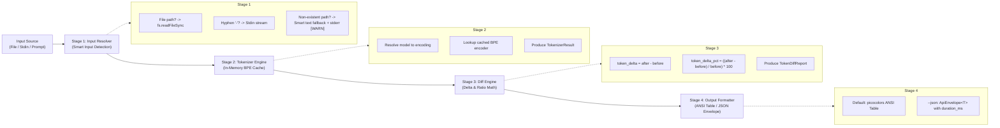

# System Architecture

Deterministic token usage measurement and context diff engine for local prompt engineering, autonomous agent pipelines, and continuous integration. This document details the layered system architecture, component dependencies, and execution pipeline.

---

## 1. Architectural Layers & Separation of Concerns

The project follows a strict Functional Core, Imperative Shell architecture to guarantee deterministic outputs and portable execution across environments (source: `src/tokenizer.ts`, `src/diff.ts`, `src/cli.ts`, `web/src/lib/diff.ts`).



### Module Responsibilities
- `src/models.ts`: Pure model-to-encoding lookup table (`o200k_base`, `cl100k_base`, `p50k_base`, `r50k_base`) with zero external runtime dependencies.
- `src/tokenizer.ts`: BPE tokenization primitive with in-memory map caching to eliminate dictionary re-instantiation overhead.
- `src/diff.ts`: Mathematical delta calculation with zero division-by-zero risk (`calculatePercentage`, `computeDiff`).
- `src/formatter.ts`: Decoupled presentation formatting providing ANSI colored tables for humans and JSON envelopes for AI agents.
- `src/cli.ts`: Command-line orchestration, smart input argument resolution, stream ingestion, and deterministic POSIX exit codes.
- `src/errors.ts`: Typed error taxonomy (`TokenDiffError`) mapping error codes to numeric exit codes and structured JSON diagnostics.
- `web/src/lib/tokenizer/worker.ts`: Dedicated Web Worker thread offloading BPE calculations from the main UI thread.
- `web/src/lib/diff.ts`: Self-contained mathematical diff engine for the web frontend.

---

## 2. Component Pipeline Diagram

Execution progresses through 4 sequential stages with explicit data boundaries (source: `src/cli.ts#L25-L122`, `src/diff.ts`):



---

## 3. Request Flow & Execution Model

The CLI enforces a synchronous, zero-disk footprint execution model (source: `src/cli.ts`, `src/tokenizer.ts`):

```mermaid
sequenceDiagram
    autonumber
    actor Caller as Developer / Agent
    participant CLI as CLI Shell (cli.ts)
    participant Resolver as Input Resolver
    participant Tokenizer as Tokenizer (tokenizer.ts)
    participant Diff as Diff Engine (diff.ts)
    participant Formatter as Formatter (formatter.ts)

    Caller->>CLI: td diff &lt;before&gt; &lt;after&gt; --model gpt-4o [--json]
    activate CLI
    CLI->>Resolver: readInputContent(before)
    Resolver-->>CLI: beforeContent (string)
    CLI->>Resolver: readInputContent(after)
    Resolver-->>CLI: afterContent (string)

    CLI->>Tokenizer: countTokens(beforeContent, "gpt-4o")
    activate Tokenizer
    Tokenizer->>Tokenizer: lookup/init cached BPE encoder
    Tokenizer-->>CLI: beforeResult (tokenCount, chars, lines)
    deactivate Tokenizer

    CLI->>Tokenizer: countTokens(afterContent, "gpt-4o")
    activate Tokenizer
    Tokenizer-->>CLI: afterResult (tokenCount, chars, lines)
    deactivate Tokenizer

    CLI->>Diff: computeDiff(beforeResult, afterResult)
    activate Diff
    Diff-->>CLI: TokenDiffReport (deltas, stats, summary)
    deactivate Diff

    alt Flag --json enabled
        CLI->>Formatter: formatJson(report, durationMs)
        Formatter-->>Caller: stdout: JSON ApiEnvelope (Exit 0)
    else Default human view
        CLI->>Formatter: formatHuman(report)
        Formatter-->>Caller: stdout: ANSI Colored Table (Exit 0)
    end
    deactivate CLI
```

---

## 4. Performance & Memory Profile

Measured on standard developer hardware (x86_64, Node.js v20.x, model: `gpt-4o` / `o200k_base`) (source: `src/tokenizer.ts`, `test/cli.test.ts`):

| Metric | Measured Baseline | Target SLA | Verification Method |
|---|:---:|:---:|---|
| Cold Start Latency | ~80 ms | < 150 ms | Process bootstrap |
| Warm Tokenization Latency | < 15 ms (<10,000 tokens) | < 25 ms | In-memory BPE execution |
| In-Memory Cache Lookup | < 0.5 ms / call | < 2.0 ms | Map lookup benchmark |
| Peak Memory Footprint (RSS) | < 38 MB | < 60 MB | `process.memoryUsage()` |
| Disk Footprint | 0 Bytes | 0 Bytes | In-memory execution, no temp files |

---

## 5. Security & Boundary Isolation

- Local Execution: No telemetry, no network calls, and no API keys required (source: `src/tokenizer.ts`).
- Zero Disk Leakage: Neither prompt contents nor diff reports are written to persistent scratch storage.
- Input Fallback Protection: Non-existent file paths fall back to raw prompt strings with an explicit warning printed strictly to `stderr` to prevent silent misinterpretation (source: `src/cli.ts#L48`).
- Browser Sandboxing: Web tokenization runs in isolated Web Workers without server transmission (source: `web/src/lib/tokenizer/worker.ts`).
