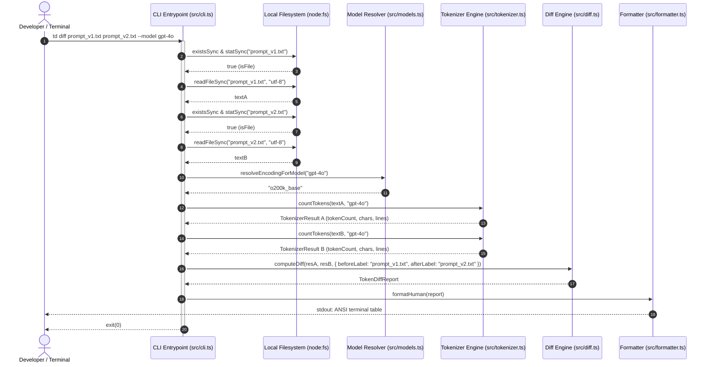
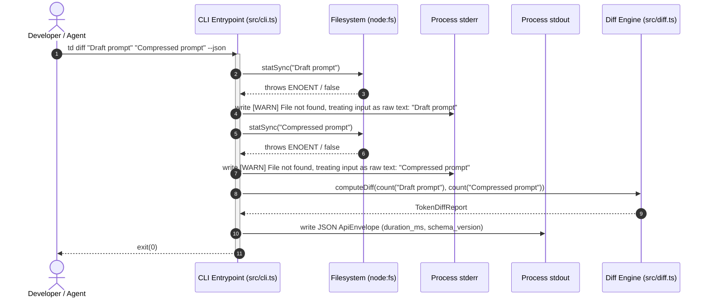
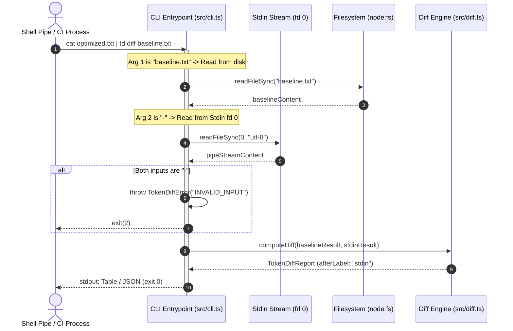
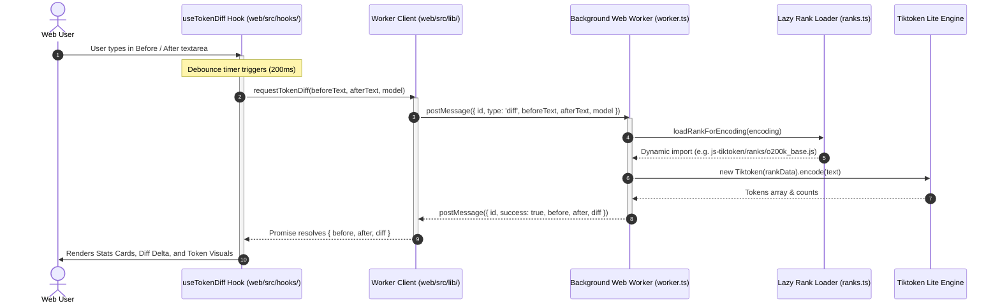

# Core Business Flows

Detailed sequence diagrams describing the primary execution flows across CLI and web runtimes. This document covers input ingestion, offline token calculation, and asynchronous browser worker orchestration.

---

## 1. Flow 1: CLI File-to-File Comparison (`td diff fileA fileB`)

Compares two local files on disk using the specified or default model tokenizer (source: `src/cli.ts#L86-L122`, `src/diff.ts`).

---

## 2. Flow 2: Smart Input Fallback Flow (`td diff "text1" "text2"`)

Automatically detects when CLI arguments are raw prompt strings rather than file paths, issuing a non-blocking stderr warning (source: `src/cli.ts#L35-L51`).

---

## 3. Flow 3: Standard Input Streaming Flow (`cat new.txt | td diff old.txt -`)

Ingests standard input pipes via the standard Unix hyphen (`-`) symbol without writing to scratch disk files (source: `src/cli.ts#L26-L33`, `src/cli.ts#L96-L98`).

---

## 4. Flow 4: Web Browser Offloaded Diff Flow (`Web Worker`)

Executes tokenizer dictionaries in a background Web Worker on the browser, preventing UI thread blocking on large text inputs (source: `web/src/hooks/useTokenDiff.ts`, `web/src/lib/tokenizer/worker.ts`, `web/src/lib/tokenizer/client.ts`).

