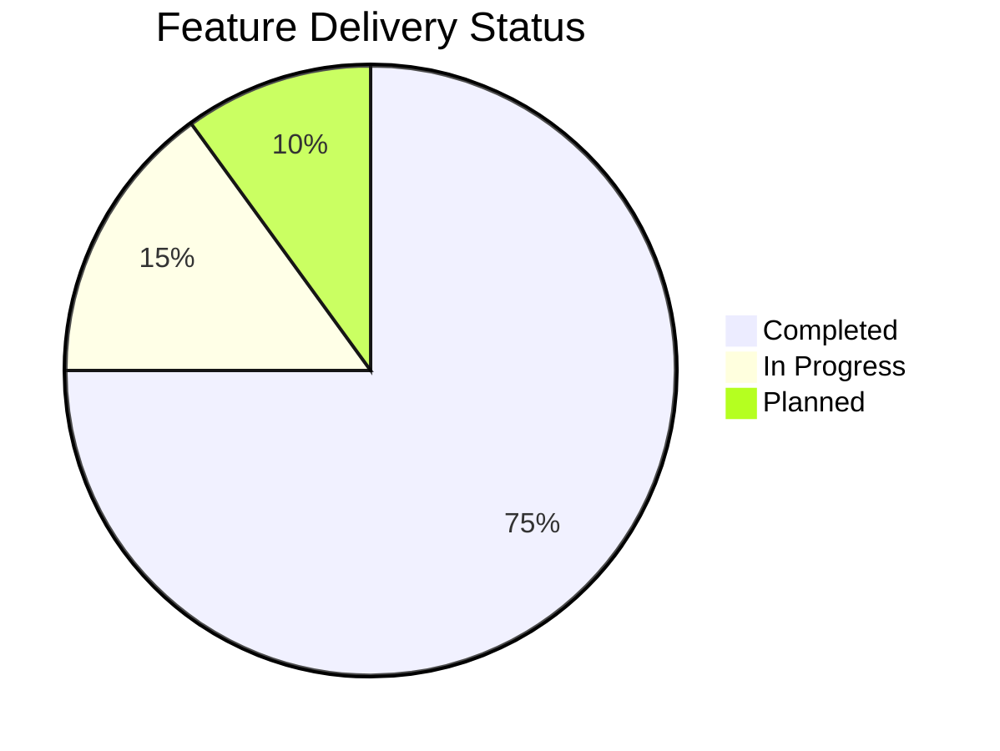

# Product Roadmap

Current implementation status, active deliverables, and planned development milestones based strictly on actual project plans and task tracking.

---

## 1. Status Overview

---

## 2. Completed Milestones (Shipped)

### Phase 1–4: Core Tokenizer Engine & CLI Distribution (v0.1.0)
- [x] In-memory Byte Pair Encoding (BPE) engine powered by `js-tiktoken` (source: `src/tokenizer.ts`).
- [x] Mathematical difference calculator with zero-division safety (source: `src/diff.ts`).
- [x] Canonical API Transport Envelope (`data` + `metadata`) for AI agents (source: `src/formatter.ts`).
- [x] Deterministic POSIX exit code mappings (0, 1, 2, 3, 4) (source: `src/errors.ts`).
- [x] Standard input streaming pipe ingestion (`-`) (source: `src/cli.ts#L26`).
- [x] Comprehensive 20-test Vitest suite covering edge cases (source: `test/`).

### Phase 5: CLI Polish & Enhancements (v0.1.1)
- [x] Concise `td` command shorthand alias registered in `package.json` (source: `package.json#L9`).
- [x] Smart Input detection with non-blocking `[WARN]` to stderr (source: `src/cli.ts#L48`).
- [x] Terminal ANSI colorization using `picocolors` (source: `src/formatter.ts`).
- [x] Multi-platform CI pipeline on GitHub Actions (Ubuntu/Windows, Node 18/20/22) (source: `.github/workflows/ci.yml`).
- [x] Refined terminal demo assets and comprehensive visual suite (source: `assets/`).

### Phase 6 & Web Phase: Web Architecture & Browser Tokenizer (Checkpoint 1 & 2)
- [x] Extracted model resolution to isomorphic module `src/models.ts` (source: `src/models.ts`).
- [x] Next.js 16 App Router scaffold with Tailwind CSS v4 and `shadcn/ui` dark theme (source: `web/`).
- [x] Browser tokenizer using `js-tiktoken/lite` and dynamic rank imports (`ranks.ts`) (source: `web/src/lib/tokenizer/ranks.ts`).
- [x] 20/20 tokenizer parity test suite asserting 100% fidelity between browser and core (source: `web/test/parity.test.ts`).
- [x] Offloaded Web Worker thread (`worker.ts`) with client fallback (`client.ts`) (source: `web/src/lib/tokenizer/worker.ts`).
- [x] Debounced `useTokenDiff` React hook with derived non-cascading loading state (source: `web/src/hooks/useTokenDiff.ts`).

---

## 3. In Progress (Active Sprint)

### Phase 6 (Cont.): Interactive Web Playground UI (`web/PLAN.md` Stage 3)
- [x] Build interactive Playground layout with Before / After text panes, character/line/token counters, and model selector (source: `web/PLAN.md#L119`).
- [x] Implement result inspection tabs (Summary table, JSON ApiEnvelope view, and CLI command generator) (source: `web/PLAN.md#L120`).
- [x] Implement responsive layout across desktop and mobile screen sizes (source: `web/PLAN.md#L123`).
- [x] Integrate bilingual UI toggle (English & Vietnamese) as confirmed during planning (source: `web/PLAN.md#L155`).

---

## 4. Planned Milestones (Upcoming)

### Web Deployment & SEO (`web/PLAN.md` Stage 4 & 5)
- [x] Configure OpenGraph social preview cards, favicon and SEO metadata (source: `web/PLAN.md#L127`).
- [x] Add web CI verification job to `.github/workflows/ci.yml` (source: `web/PLAN.md#L131`).
- [ ] Deploy Next.js Web Playground to Vercel targeting default `*.vercel.app` domain (source: `web/PLAN.md#L133`).

### NPM Public Release
- [ ] Publish `ai-token-diff` to public npm registry once 2FA account lock period expires (source: `package.json`).
