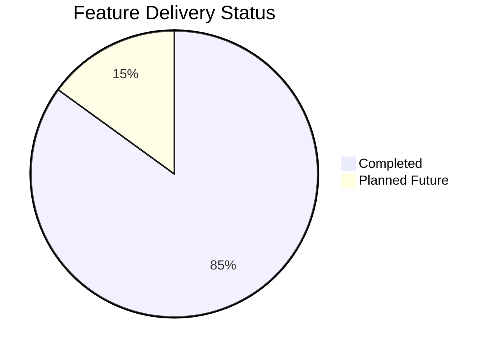

# Product Roadmap

Current implementation status, completed deliverables, and planned development milestones for future iterations. This document tracks delivered features and outlines future architectural expansions.

---

## 1. Status Overview

---

## 2. Completed Milestones (Shipped)

### Core Tokenizer Engine & CLI Distribution (v0.1.0)
- In-memory Byte Pair Encoding (BPE) engine powered by `js-tiktoken` (source: `src/tokenizer.ts`).
- Mathematical difference calculator with zero-division safety (source: `src/diff.ts`).
- Canonical API Transport Envelope (`data` + `metadata`) for AI agents (source: `src/formatter.ts`).
- Deterministic POSIX exit code mappings (0, 1, 2, 3, 4) (source: `src/errors.ts`).
- Standard input streaming pipe ingestion (`-`) (source: `src/cli.ts#L26`).
- Comprehensive 20-test Vitest suite covering edge cases (source: `test/`).

### CLI Polish & Enhancements (v0.1.1)
- Concise `td` command shorthand alias registered in `package.json` (source: `package.json#L9`).
- Smart Input detection with non-blocking `[WARN]` to stderr (source: `src/cli.ts#L48`).
- Terminal ANSI colorization using `picocolors` (source: `src/formatter.ts`).
- Multi-platform CI pipeline on GitHub Actions (Ubuntu/Windows, Node 18/20/22) (source: `.github/workflows/ci.yml`).
- Standardized demo assets and visual documentation suite (source: `assets/`).

### Interactive Web Application & Production Deployment (v0.2.0)
- Client-side Next.js 16 Web Application with Tailwind CSS v4 and `shadcn/ui` (source: `web/`).
- Interactive Playground with Before/After editors, model switcher, and live stats (source: `web/src/components/playground/`).
- Dedicated Web Worker execution offloading with lazy dynamic rank loading (source: `web/src/lib/tokenizer/worker.ts`).
- 22 web tests asserting 100% token count parity and hook debounce correctness (source: `web/test/`).
- SEO metadata, dynamic OpenGraph image, robots.txt, sitemap.xml, and brand icons (source: `web/src/app/`).
- Production deployment on Vercel (`https://token-diff.vercel.app`) with custom security headers (source: `web/vercel.json`).
- Package published to public npm registry as `ai-token-diff` (source: `package.json`).

---

## 3. Planned Future Milestones

### Milestone 1: Multi-Model & Open Weights Tokenizer Support
- Add support for Llama 3 and Mistral BPE / SentencePiece tokenizers.
- Add heuristic estimation and official tokenizer integration for Anthropic Claude and Google Gemini models.
- Abstract the tokenizer interface to allow plugging custom tokenizer vocabularies via JSON config.

### Milestone 2: GitHub Action & Automated PR Context Budgeting
- Develop an official `token-diff-action` for GitHub Actions.
- Enable automated comments on Pull Requests that modify prompt templates or documentation, showing exact token deltas.
- Provide configurable threshold budgets that fail CI if a prompt change increases tokens by more than a specified percentage.

### Milestone 3: Batch Directory Comparison
- Implement `td diff-dir <dir1> <dir2>` command to recursively calculate cumulative token changes across entire prompt folders.
- Emit aggregate summary tables and machine-readable JSON envelopes containing file-by-file breakdowns.

### Milestone 4: Web Playground Shareable Permalinks & Export
- Add URL state encoding (e.g. gzip-compressed hash in URL) to enable sharing prompt comparison permalinks.
- Add export buttons to download comparison cards as PNG images, SVG badges, or Markdown summary tables.
