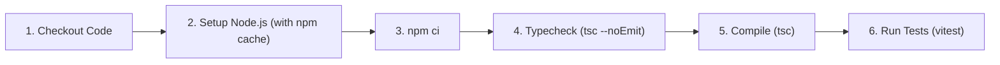

# Deployment & CI/CD Operations

Operational specifications for building, packaging, CI verification, and deploying `token-diff` across npm and Vercel.

---

## 1. Automated CI/CD Pipeline (GitHub Actions)

Continuous Integration runs on every push and pull request to the `main` branch (source: `.github/workflows/ci.yml`).

### Test Matrix
- **Operating Systems**: `ubuntu-latest`, `windows-latest`
- **Node.js Versions**: `18.x`, `20.x`, `22.x`

### Workflow Steps


---

## 2. NPM Package Packaging & Publishing

The core package is configured for zero-friction distribution on npm (source: `package.json#L4-L34`).

### Lifecycle Hooks
- **`prepack` script**: Automatically triggers `npm run build && npm test` before an archive is generated to ensure broken code is never published.
- **Published Files Whitelist**: Strictly bundles `dist/`, `README.md`, `README.vi.md`, `assets/`, and `LICENSE`. The `web/`, `test/`, and `tasks/` directories are completely excluded from the npm tarball.

### Local Packaging Verification
```bash
# Verify the exact tarball contents and size before publishing
npm pack --dry-run
```

---

## 3. Vercel Web Deployment (`web/`)

The web playground is deployed as a static/edge-compatible Next.js application on Vercel (source: `web/PLAN.md#L133`).

### Configuration Parameters
- **Framework Preset**: `Next.js`
- **Root Directory**: `web`
- **Build Command**: `npm run build`
- **Output Directory**: `.next` (default Next.js output)
- **Source Ingestion**: Enable *"Include source files outside of the Root Directory"* in Vercel project settings to allow resolution of core bindings (`ai-token-diff: "file:.."`).
- **Production Branch**: `main`
- **Domain**: Default Vercel production domain (`*.vercel.app`)

---

## 4. Docker & Containerized Usage (Optional)

Because `token-diff` has zero native compilation dependencies, it runs reliably inside minimal, read-only Linux containers:

```dockerfile
# Example minimal container execution
FROM node:20-alpine
WORKDIR /app
COPY package*.json ./
RUN npm ci --omit=dev
COPY dist ./dist
ENTRYPOINT ["node", "dist/cli.js"]
CMD ["--help"]
```
