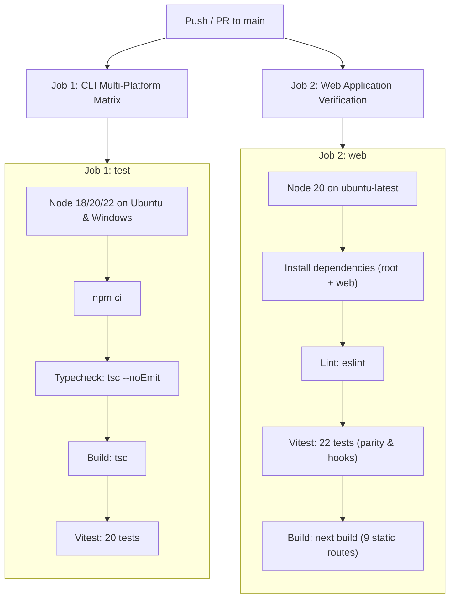

# Deployment & CI/CD Operations

Operational specifications for building, packaging, CI verification, and deploying `token-diff` across npm and Vercel. This document outlines automated testing pipelines and production hosting configurations.

---

## 1. Automated CI/CD Pipeline (GitHub Actions)

Continuous Integration runs automatically on every push and pull request targeting the `main` branch (source: `.github/workflows/ci.yml`).

### CI Jobs Structure
The workflow defines two parallel verification jobs:
1. **Core CLI Matrix (`test`)**:
   - Operating Systems: `ubuntu-latest`, `windows-latest`
   - Node.js Versions: `18.x`, `20.x`, `22.x`
   - Steps: `npm ci` -> `npm run lint` -> `npm run build` -> `npm test` (20 tests)
2. **Web Application Job (`web`)**:
   - Operating System: `ubuntu-latest`
   - Node.js Version: `20.x`
   - Steps: `npm ci` (root) -> `npm run build` (core) -> `cd web && npm ci` -> `npm run lint` -> `npm test` (22 tests) -> `npm run build` (Next.js production build)



---

## 2. NPM Package Packaging & Publishing

The core package is published to the public npm registry under `ai-token-diff` (source: `package.json`).

### Lifecycle Configuration
- **`prepack` script**: Automatically executes `npm run build && npm test` prior to packaging, ensuring uncompiled or failing code is never released.
- **Published Whitelist**: Configured via the `"files"` field in `package.json`, packaging only `dist/`, `README.md`, `README.vi.md`, `assets/`, and `LICENSE`. Test suites, documentation, and the `web/` application are strictly omitted from the distribution bundle.

### Publishing Commands
```bash
# Verify archive contents without publishing
npm pack --dry-run

# Publish package to npm registry
npm publish --access public
```

---

## 3. Vercel Web Deployment (`web/`)

The interactive web playground is deployed to Vercel at `https://token-diff.vercel.app` (source: `web/vercel.json`, `web/next.config.ts`).

### Configuration Parameters
- **Root Directory**: `web`
- **Application Preset**: `Next.js` (detected automatically)
- **Build Command**: `next build`
- **Output Directory**: `.next`
- **Security Headers (`web/vercel.json`)**:
  - `X-Content-Type-Options: nosniff` (mitigates MIME sniffing)
  - `X-Frame-Options: DENY` (prevents clickjacking attacks)
  - `Referrer-Policy: strict-origin-when-cross-origin`
  - Long-term `Cache-Control` (`immutable`) for static icons and metadata assets
- **Production Branch**: `main`

---

## 4. Docker Container Execution (Optional)

Because `token-diff` has zero native compilation dependencies, it executes cleanly within minimal Alpine container images:

```dockerfile
FROM node:20-alpine
WORKDIR /app
COPY package*.json ./
RUN npm ci --omit=dev
COPY dist ./dist
ENTRYPOINT ["node", "dist/cli.js"]
CMD ["--help"]
```
